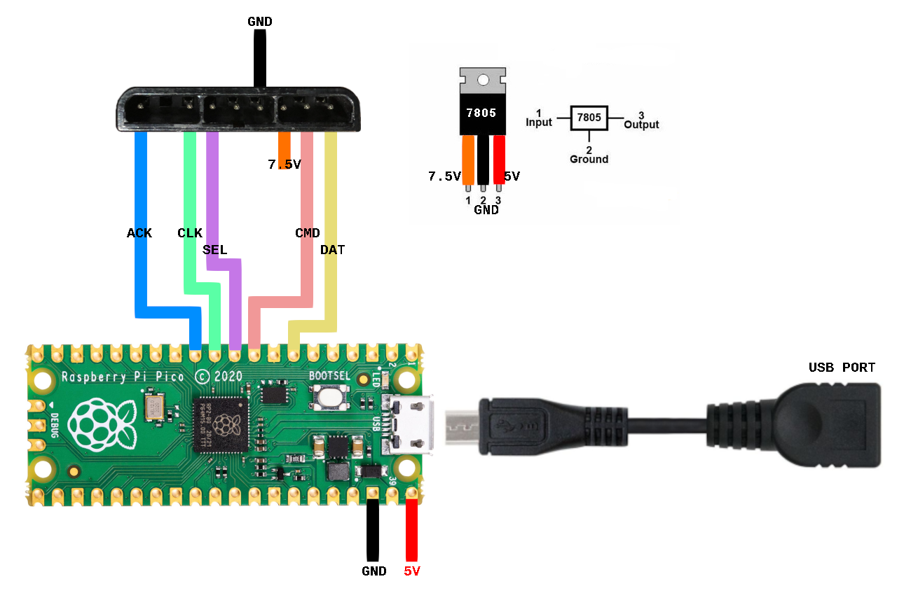
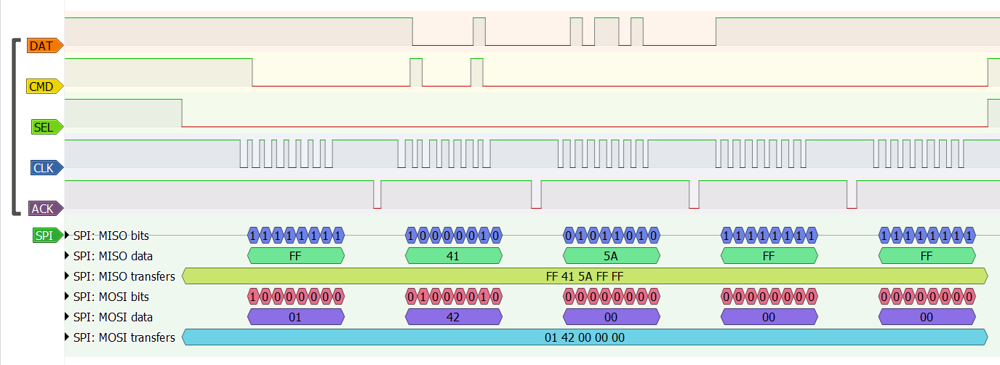
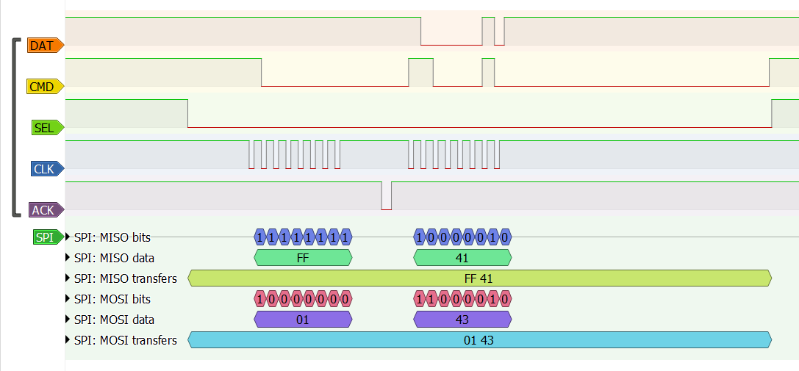

# pico-ds
An xinput to DualShock(2) "translator" written for the Raspberry Pi Pico. Source code release pending.

It currently only emulates a Digital Pad. A test build is provided under the `build` directory.

This Pi Pico firmware uses the TinyUSB modified host stack to read inputs from Xbox controllers, using tusb_xinput, an implementation of xinput for the Pi Pico. However, this is not perfect. These issues are described below.

It also utilizes the powerful PIO feature of this MCU, to emulate the communication between the PS1/PS2 and the controllers, based off of the PicoMemcard repo.

This software is delivered as-is, and comes with no warranty. Do not make this mod if you don't have enough experience. I take no resposability for the things you mess up.

---

## Connections Schematic and parts required

The currently required parts are listed here:
* A voltage regulator to get 5V from the 7.5V (or 9V?) motor power line from the PS1/PS2. USB peripherals **need** 5V.  
The cheapest option is a LM7805 linear regulator. This is however inefficient and will produce a lot of heat if using wired controllers, but it will fit nicely in a small custom PCB and case.  
A more expensive option is a switched buck converter. Much more efficiente but big and bulky.  
But be very careful. There is a fuse on this line, that prevents more than 700mA (if I remember correctly) to be drawn. I take no responsability if something goes wrong.
* Jumper wires to connect everything.
* A micro USB OTG cable (or USB C OTG, depending on your Pico USB plug).
* (Optional) Resistors and LEDs for some visual cues.
* (Optional) USB to serial converter to see Debug information.
* (Optional but very recommended) A pushbutton to reboot the Pico every time it freezes, connected between a GND pin and the Run pin.

Maybe I (or someone) will design a custom PCB to accommodate everything in a small and nice case.

### Schematic

This is a quickly drawn schematic, but I hope it is informative. Double and triple check your very own LM7805 pinout.



More information on the connection of things will be added later.

---

## Controllers notes

### PS1 Digital Pad

This controller, also known as DualDigital, only responds to command `0x01 0x42 ...` (check [references](#references) for more information). That means, that when a PS2 tries to enter config mode `0x01 0x43`, the controller does not acknowledge this, and then the PS2 recognizes it as a Digital Pad.

Here we can see a `0x42` command communication, and the ACK line go low after every (except the last) byte received by the controller.



Here we can see a `0x43` command communication, and the ACK does NOT go low after the `0x43` byte is received by the controller, and communication ends.



### Og Xbox Controller

This controller does not use a standard USB port, but the communication protocol is indeed a standard USB, and we only need an adapter (recommended, can always come back to use it with the Xbox), soldering a USB cable to the controller motherboard (not recommended) or cut the cable and solder a USB male plug to that (even less recommended), to get it ready to use.

My favorite method is to use an Xbox 360 USB Breakaway cable, and sand the plastic inside the "circular part" of this cable, enough to fit the Og Xbox part. If this is not clear enough, I'll be happy to make a small tutorial in this repo.

### Xbox One Pad initialization

I'm having trouble initializing Xbox One (S, specifically) sometimes. After plugging it in, nothing happens, USB can't even be used to give it power. You will need a power supply capable of more (milli) amps. The LM7805 method should be enough.

---

## Some USB issues

There are a couple of problems that come with the use of TinyUSB and tusb_xinput.

### USB Hubs  (UPDATE: First working tests)

After a full day finding what was going wrong, I came to the conclusion that the maximum number of endpoints calculated by the code was missing the number of endpoints that the Xinput driver was "enabling". Therefore only a line of coded needed to be modified and now using USB Hubs and most importantly, the OG Xbox Controller appears to be fully working!

Not perfectly tho. Because TinyUSB only supports "1 level" of Hubs (we can't connect a Hub to another Hub), and as OG Xbox Controllers are Hubs, we can only plug one directly to the Pico. Other controllers seem to work fine in Hubs.

See details on modification [below](#second-modification)!

### Time interval between reports
This could an tusb_xinput issue, and could be a big one, because this time interval is around 8-10ms, which could slow things down for up to a frame, depending on when the button is pressed and when the press is reported.

**Possible causes and solutions**

* If this is a TinyUSB problem, maybe a future update will get things fully working.
* If this is a tusb_xinput issue, maybe taking a deeper look at the Xinput implementation will get things properly working.
* If this is a hardware limitation, nothing could be done.

For both problems, maybe writing a lower lever xinput driver will make things work much better but will be way harder and take much longer to have it finished.

Another option is using a modified version of the [Pico-PIO-USB](https://github.com/sekigon-gonnoc/Pico-PIO-USB) firmware, to have it only support Full Speed Devices, because enabling both LS and FS take almost all 64 (2x32) bytes of available PIO instruction memory. If we only have support for FS devices (all Xbox, 360 and One controllers are FS anyway), the instruction memory might be enough, and we might be able to have a lower level (therefore faster) communication between your Xbox controller and the PS1/PS2. An additional problem might occur, because Pico-PIO-USB uses a 120MHz clock (instead of 125MHz), and a modification to the `psxSPI.pio` (based on 125MHz) file to divide to a proper clock will be necessary. Also, apparently, some USB controllers didn't really want to connnect, such as my Xbox 360 Rock Band Stratocaster Guitar.

---

##

Videos:

Some videos showcasing properties of this firmware:

<!-- [](https://www.youtube.com/watch?v=y0nJE96_HKE) -->

<iframe width="560" height="315" src="https://www.youtube.com/embed/y0nJE96_HKE" title="YouTube video player" frameborder="0" allow="accelerometer; autoplay; clipboard-write; encrypted-media; gyroscope; picture-in-picture" allowfullscreen></iframe>

<!-- [](https://www.youtube.com/watch?v=pAiFyhjvZcM) -->

<iframe width="560" height="315" src="https://www.youtube.com/embed/pAiFyhjvZcM" title="YouTube video player" frameborder="0" allow="accelerometer; autoplay; clipboard-write; encrypted-media; gyroscope; picture-in-picture" allowfullscreen></iframe>

## Source code notes:

Source code will be released when I improve data transfers and a cleanup is made.

### File `psxSPI.pio`

This file has been based off the [PicoMemcard's pmc+ release branch](https://github.com/dangiu/PicoMemcard/blob/pmc%2B/development/psxSPI.pio), deleting the (currently) unnecessary `dat_reader` program.

### TinyUSB modified stack

Follow instructions from https://github.com/Ryzee119/tusb_xinput.

Specifically, this commit: https://github.com/Ryzee119/tinyusb/commit/4a61b7ac61c7cfefb80a3abfd0891adf105c545c, tells you to modify files `src/host/usbh.c` and `src/tusb.h` to get things working.

#### Second modification

Locate the `hcd.h` file inside the `/src/host` folder on the `tinyusb` source code.

As of August 14th of 2022, locate line `43` (or somewhere close). It should read something like:

```C
...
42 #ifndef CFG_TUH_ENDPOINT_MAX
43   #define CFG_TUH_ENDPOINT_MAX   (CFG_TUH_HUB + CFG_TUH_HID*2 + CFG_TUH_MSC*2 + CFG_TUH_CDC*3)
44 //  #ifdef TUP_HCD_ENDPOINT_MAX
...
```

and change it to: (multiplying by 2 works because every controller has one for input and one for output, but more research into a specific number might necessary)

```C
43   #define CFG_TUH_ENDPOINT_MAX   (CFG_TUH_HUB + CFG_TUH_HID*2 + CFG_TUH_MSC*2 + CFG_TUH_CDC*3 + CFG_TUH_XINPUT*2)
```

and done.

### The tusb_xinput driver

A custom xinput driver written by Ryzee119 (https://github.com/Ryzee119/tusb_xinput) is used as a base for the currently working version. Further modifications will be requiered to adapt it to this specific case.

As of now, everythings seems to work fine.

---

## References

Most documentation used is already available online:

* For information about PS1/PS2 "SPI" communication protocol:
  * https://psx-spx.consoledev.net/controllersandmemorycards
  * http://www.emudocs.org/PlayStation/psxcont/
  * https://store.curiousinventor.com/guides/PS2
  * https://gist.github.com/scanlime/5042071
  * https://github.com/Lameguy64/PSn00bSDK
  * https://hackaday.io/project/170365-blueretro/log/186471-playstation-playstation-2-spi-interface
  * https://problemkaputt.de/psx-spx.htm#controllersandmemorycards
  * https://psxdatacenter.com/


* For information about Xbox/Xbox360/XboxOne USB descriptors and data format:
  * https://github.com/paroj/xpad
  * https://www.partsnotincluded.com/understanding-the-xbox-360-wired-controllers-usb-data/
  * https://github.com/medusalix/xone
  * https://github.com/quantus/xbox-one-controller-protocol

* `psxSPI.pio` code taken from PicoMemcard (pmc+/release branch): https://github.com/dangiu/PicoMemcard/

* A modified version of TinyUSB (https://github.com/hathach/tinyusb) is used as the host stack for the Pi Pico, [see above](#tinyusb-modified-stack).

* An xinput implementation for the Pi Pico: https://github.com/Ryzee119/tusb_xinput